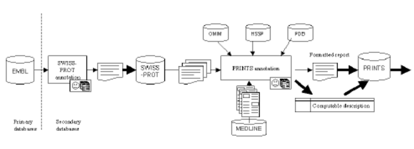
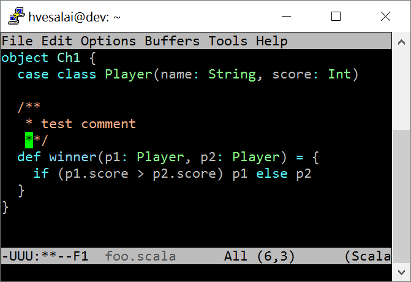

**Data Annotations and Comments in Big Data Technologies**

By: Nicholas Ogbonna

**Introduction**

Reading uncommented code is akin to maneuvering around a dense forest.
Hence why most languages have the ability to leave annotations and
comments. The goal is to highlight crucial points in the program and
record comments that specifically draw links to essential features. This
can help with systematic preparation for other programmers making
changes to the program or users trying to understand the code more.
Annotating any text can also assist you in composing a well-written
answer to those who come to you for questions about your code.

So what is Data annotation?

Data annotation involves grouping and classifying data for artificial
intelligence(AI) programs (Barnes, 2012). Annotations allow data
classification into many formats, such as videos, images, and text. It
is done to optimize the decision-making of AI programs. They also reduce
the chance of obtaining erroneous output from the AI (Barnes, 2012).
Data annotation modalities differ depending on the form of data. These
include images, text, and audio. On the other hand, comments are short
descriptions added by programmers to the source code. The comments are
added to enhance human understanding of the code (Barnes, 2012). The
compiler usually ignores the comments. Generally, Annotations originated
from the ancient Arab societies in 1000 AD (Buneman, 2000). The scribes
included annotations on the margins of their manuscripts circulated in
the communities. Annotations in information technology originated in the
1980s and 1990s, where they were developed to enable legal data
processing. Annotations have been evolving since the 1980s, when they
were first used in information technology. Big data technologies have
found annotations to be very important in their daily data analysis
process.

**Spark technology**

{width="2.34375in" height="1.0098064304461942in"}

Apache Spark is a fast multi-purpose computing technology customized for
extensive data processing (Barnes, 2012). Spark Natural language
processing uses different annotation strategies to enhance the speed of
decision-making in artificial intelligence applications. Spark uses an
unsupervised learning technique to fasten the annotation process. Under
unsupervised learning, Spark uses the clustering method (Barnes, 2012).
This method involves the grouping of data into various categories using
data-entry features. The clustering process is enabled by Spark mllib
package, which contains multiple algorithmic models to enhance
clustering. The algorithmic models include Gaussian mixture, K-means,
power iteration clustering, latent Dirichlet allocation, bisecting
K-means, and Streaming K-means (Barnes, 2012). Spark also uses the
Semantic data annotation strategy (Barnes, 2012). Semantic annotation is
the process of aligning particular documents to specifically related
concepts. The records usually contain metadata, which are references
that connect the document content to concepts, presented in graphical
format. The linking enhances easy access to unstructured content, thus
enabling interpretation.

{width="5.179687226596675in"
height="1.859375546806649in"}

Finally, Spark technology uses data annotation pipelines. Annotation
pipelines involve a combination of different annotation strategies. The
data is first put through an automatic annotation process which is less
costly. The processed data is then analyzed by manual means. This
approach enables quality output using a cheap budget. The structure of a
basin Spark operation (the annotation) includes the annotator type,
begin, end, result, which is the annotation\'s main output, metadata,
and embeddings.

{width="3.2371270778652668in"
height="2.220336832895888in"}

Spark uses scalar comments. Scala comments include single line,
multiline and documentation comments (Barnes, 2012). Single line
comments occupy only one line. Only multiline comments occupy more than
one line. On the other hand, documentation comments are present for the
first lookup; pressing the Control + Q button makes them available.

**Hive strategies**

{width="2.0833333333333335in"
height="0.5884601924759405in"}

Apache Hive is a freeware program used to manage big data files
contained in data storage systems, primarily the Hadoop Distributed File
systems (Du,2015). Hive contains a flexible infrastructure, which
enables the programmer to implement new tools and algorithms. The
labeling of data in Hive is through categorizing. Hive uses various
strategies and techniques in data annotation. The methods include
bounding boxes, landmarking, polygonal segmentation, and tracking
(Du,2015).

{width="5.496964129483815in"
height="3.162516404199475in"}

Bounding boxes are a simple annotation technique that entails drawing a
square around the intended object. This method works best with
symmetrical objects and objects whose shape is less relevant.

{width="4.109830489938758in"
height="2.713542213473316in"}

Landmarking entails applying tiny dots across the thing. The beads help
perceive and measure the data characteristics. The method is widely
applied in facial recognition to perceive facial features. This approach
can classify human bodies, tag the posture and identify the
relationships between various body elements. Landmarking is also used to
identify necessary objects from an aerial view (Du,2015).

Hive also uses a strategy called tracking when annotating. Tracking
involves tracing the movement of an object via many frames. An annotator
can classify one frame and then skip many frames before indicating the
new frame position using interpolating tools. This process is done
automatically by the annotating tools.

{width="5.434097769028871in"
height="3.5156255468066493in"}

Additionally, Hive uses a polygonal segmentation strategy. This
technique is an improvement of the bounding box strategy. It applies
different shapes in identifying the position of the targeted object. The
most common shape used is a polygon. The method is more accurate than
the bounding box method because it effectively captures boundaries. The
figures do not capture unnecessary pixels that can disorient the
annotator. The technique effectively captures asymmetric objects. The
final strategy is the use of polylines (Du,2015). Polylines are
continuous parts of one or many lines. The method is applied when the
things of interest have a linear design.

Hive uses commenting strategies that are also used by many big data
technologies. The strategies include: inline commenting, function
commenting, and class commenting. Class commenting entails comments that
concern the whole page. The comments contain the general overview, the
related files, the author, and his personal details. They may be in the
form of a footer. On the hand, Function commenting involves inserting a
comment above a function that provides needed details about it. Finally,
inline commenting entails comments that are placed at the end of a line
of code.

Annotation in Hive technologies is done on an employer-by-employer basis
(Du,2015). This means that the employer will determine the technique to
be used and his processing needs. For instance, an employer may need to
trace an object via many frames implying that he would have to use the
tracking annotation technique. However, Hive has a universal rubric for
code commenting. It applies Scala commenting strategy.

There are specific guidelines that dictate how comments and annotations
should be applied. These guidelines are universal and do not vary with
the region (Xia, 2019). The commenting guidelines require that
commenting should include comment tags. The comments should also be kept
in the editor window so that other users can see them easily. They
should consist of reasons for a specific function, for instance, reasons
for including a certain function. Additionally, comments should not
refer to other sources or comments implying that comments should fully
qualify themselves (Xia, 2019). Finally, the author should write
comments while writing the code to ensure that he does not forget the
logic.

**Conclusion**

*Generally, a comment should contain its purpose, the logical aspect of
the comment, and how to implement its function. Comments should be
placed in the code editing window to enhance understanding by other
users of the code. On the other hand, annotations are certain attributes
that are conducted on groups of data for specific validity checks. The
validity checks outline the format in which the data will be output and
the relationship between the data. With the increased advancements in
big data analytics, it is important to develop sustainable labeling and
annotation techniques. It is evident data labeling is a great problem
when designing AI products*.

**References**

Barnes, J. (2012). *SPARK: The Proven Approach to High Integrity
Software*. Altran Praxis.
[[https://dl.acm.org/doi/abs/10.5555/2436812]{.underline}](https://dl.acm.org/doi/abs/10.5555/2436812)

Buneman, P., Maier, D., & Widom, J. (2000, March). Where was your data
yesterday, and where will it go tomorrow? Data Annotation and Provenance
for Scientific Applications. In *Position paper for NSF Workshop on
Information and Data Management (IDM 2000): Research Agenda into the
Future, Chicago IL*.
[[http://gjfb0520.sid.inpe.br/col/dpi.inpe.br/banon/2004/04.21.11.45/doc/BunemanWhereTomorrow.pdf]{.underline}](http://gjfb0520.sid.inpe.br/col/dpi.inpe.br/banon/2004/04.21.11.45/doc/BunemanWhereTomorrow.pdf)

Du, D. (2015). *Apache Hive Essentials*. Packt Publishing Ltd.
[[https://books.google.com/books?hl=en&lr=&id=4S7WBgAAQBAJ&oi=fnd&pg=PP1&dq=data+annotation+and+commenting+in+hive+&ots=KUjVNVjFPc&sig=wLzbM5eJJmhPSdd7tJiwXzv-3fA]{.underline}](https://books.google.com/books?hl=en&lr=&id=4S7WBgAAQBAJ&oi=fnd&pg=PP1&dq=data+annotation+and+commenting+in+hive+&ots=KUjVNVjFPc&sig=wLzbM5eJJmhPSdd7tJiwXzv-3fA)

Xia, X., Wan, Z., Kochhar, P. S., & Lo, D. (2019, May). How
practitioners perceive coding proficiency. In *2019 IEEE/ACM 41st
International Conference on Software Engineering (ICSE)* (pp. 924-935).
IEEE.
[[https://ieeexplore.ieee.org/abstract/document/8812050/?casa_token=l1iK2IG-VhIAAAAA:R-aywipVTgapy1Xf-FyXROYMOuh4iGwKjItwivg8fwDBKkvuc9NCt39vT3dOW7vceHQXUerTupo6]{.underline}](https://ieeexplore.ieee.org/abstract/document/8812050/?casa_token=l1iK2IG-VhIAAAAA:R-aywipVTgapy1Xf-FyXROYMOuh4iGwKjItwivg8fwDBKkvuc9NCt39vT3dOW7vceHQXUerTupo6)

**Images**

Spark Tech logo: https://www.facebook.com/sparktechllc/

Hive Tech Logo:
[[https://media-exp1.licdn.com/dms/image/C560BAQHnjeCg_shgqg/company-logo_200_200/0/1519909314480?e=2147483647&v=beta&t=A44IVd28enCpqTtleskj7yNQkJAOW1AKwNLyFr9JUGc]{.underline}](https://media-exp1.licdn.com/dms/image/C560BAQHnjeCg_shgqg/company-logo_200_200/0/1519909314480?e=2147483647&v=beta&t=A44IVd28enCpqTtleskj7yNQkJAOW1AKwNLyFr9JUGc)

Bounding Boxes:

[[https://keymakr.com/blog/content/images/2021/05/boxes.jpg]{.underline}](https://keymakr.com/blog/content/images/2021/05/boxes.jpg)

Polygonal Segmentation:
[[https://www.cogitotech.com/assets/uploads/media-uploader/semantic-segmentation-for-irregular-shapes1625645254.jpg]{.underline}](https://www.cogitotech.com/assets/uploads/media-uploader/semantic-segmentation-for-irregular-shapes1625645254.jpg)

Landmarking:

[[https://miro.medium.com/max/1024/1\*kmu_t1iNbOipwozjxCG6og.jpeg]{.underline}](https://miro.medium.com/max/1024/1*kmu_t1iNbOipwozjxCG6og.jpeg)

scala comments:
[[https://user-images.githubusercontent.com/861035/26904412-717c7280-4bea-11e7-8686-aeb14671da9a.png]{.underline}](https://user-images.githubusercontent.com/861035/26904412-717c7280-4bea-11e7-8686-aeb14671da9a.png)

Data annotation pipeline:

[[https://www.researchgate.net/profile/Robert-Stevens-19/publication/221197942/figure/fig1/AS:305466618990592@1449840325068/The-flow-of-information-through-the-annotation-pipeline-A-large-variety-of-databases-or.png]{.underline}](https://www.researchgate.net/profile/Robert-Stevens-19/publication/221197942/figure/fig1/AS:305466618990592@1449840325068/The-flow-of-information-through-the-annotation-pipeline-A-large-variety-of-databases-or.png)
